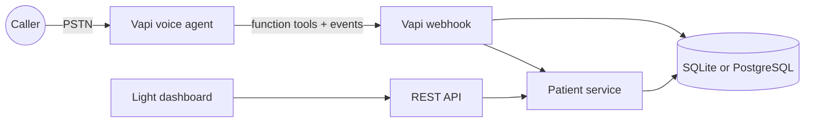

# Voice AI Patient Registration

A complete patient-intake system: callers register through a Vapi-managed U.S. phone number, validated demographics persist in SQLite locally or PostgreSQL when deployed, and staff can use a REST API or a light web dashboard.

## What is included

- Natural speech intake with field-specific recovery, corrections, restart, confirmation, and graceful save failures
- Duplicate-phone detection with an update offer
- Idempotent Vapi tool handling and end-of-call transcript storage
- REST create/read/list/update/soft-delete API with consistent JSON envelopes
- Server-side validation and database constraints
- Responsive, accessible, light-mode dashboard
- Secret-authenticated Vapi webhooks
- 19 automated API, persistence, dashboard, and Vapi webhook tests
- Component, sequence, state, and data-model diagrams in [`docs/`](docs/ARCHITECTURE.md)
- Step-by-step zero-payment setup in [`docs/ZERO_COST_VAPI_SETUP.md`](docs/ZERO_COST_VAPI_SETUP.md)
- Submission deployment Blueprint and runbook in [`docs/DEPLOYMENT.md`](docs/DEPLOYMENT.md)

## Architecture at a glance



The voice agent and REST routes both call the same patient service, which keeps business rules in one place. See [Architecture](docs/ARCHITECTURE.md), [Voice agent](docs/VOICE_AGENT.md), [API](docs/API.md), and [Data model](docs/DATA_MODEL.md).

## Run locally

Prerequisites: Python 3.11+.

```bash
python3 -m venv .venv
source .venv/bin/activate
pip install -e '.[dev]'
cp .env.example .env
uvicorn app.main:app --reload
```

Open:

- Dashboard: <http://localhost:8000/>
- OpenAPI UI: <http://localhost:8000/docs>
- Health check: <http://localhost:8000/health>

The REST API and dashboard work without external credentials. Vapi owns speech recognition, conversation orchestration, the model, voice synthesis, and telephony. The app receives authenticated tool calls and call reports.

## Configure a real phone number

1. Deploy the app at a public HTTPS URL by following [Deployment](docs/DEPLOYMENT.md).
2. Create a blank Vapi assistant and paste [`vapi/assistant-prompt.md`](vapi/assistant-prompt.md) as its system prompt.
3. Create both function tools from [`vapi/`](vapi/), replace `YOUR_DOMAIN`, and configure the same secret as `VAPI_WEBHOOK_SECRET`.
4. Claim the free inbound U.S. number, assign the assistant, and enable the `end-of-call-report` server message.
5. Call the number, confirm a registration, and verify it in the dashboard.

The free Vapi number does not require a payment method, but calls consume Vapi credits. Keep auto-reload disabled to prevent charges.

## Environment variables

| Variable | Required | Default | Purpose |
|---|---:|---|---|
| `DATABASE_URL` | No | `sqlite:///./data/patients.db` | Persistent database connection |
| `PUBLIC_BASE_URL` | For calls | `http://localhost:8000` | Public HTTPS application origin |
| `VAPI_PRIVATE_API_KEY` | Setup only | — | Optional server-side Vapi administration; never exposed to clients |
| `VAPI_WEBHOOK_SECRET` | Yes | — | Authenticates Vapi tool and event webhooks |
| `VAPI_ASSISTANT_ID` | Deployment only | — | Documents the configured assistant |
| `VAPI_PHONE_NUMBER` | Deployment only | — | Documents the assigned free inbound number |
| `APP_ENV` | No | `development` | Set to `test` only in automated tests |
| `LOG_LEVEL` | No | `INFO` | Application logging threshold |

## API example

```bash
curl -X POST http://localhost:8000/patients \
  -H 'Content-Type: application/json' \
  -d '{
    "first_name": "Jane",
    "last_name": "Doe",
    "date_of_birth": "1988-04-12",
    "sex": "Female",
    "phone_number": "512-555-0199",
    "address_line_1": "1400 Congress Avenue",
    "city": "Austin",
    "state": "TX",
    "zip_code": "78701"
  }'
```

All REST responses follow `{ "data": ..., "error": null }`; errors set `data` to `null` and provide a stable code and message.

## Verify

```bash
pytest --cov=app --cov-report=term-missing
ruff check .
```

## Security and privacy

- Secrets come only from environment variables; `.env` and database files are ignored by Git.
- Vapi webhooks require a constant-time checked bearer token or `X-Vapi-Secret` header.
- Completed registrations log the patient UUID, action, and field names—not raw PHI.
- SQLAlchemy uses parameterized statements and Pydantic rejects malformed input.

This assessment is not represented as HIPAA-compliant. A real healthcare deployment also needs authentication/authorization, encryption and managed key rotation, audit access logs, retention policies, backups, BAAs with vendors, incident response, and a formal risk assessment.

## Trade-offs and known limitations

- Voice behavior, latency, and barge-in depend on the selected Vapi model, transcriber, and voice.
- SQLite is used locally; the free submission deployment uses PostgreSQL because hosted filesystems are ephemeral. Use managed backups for production.
- Schema creation uses SQLAlchemy metadata. Introduce Alembic before evolving a live production schema.
- Saving is idempotent per Vapi call ID, so a retried tool webhook cannot create a second record.
- Dashboard and patient API authentication are deployment responsibilities and must be added before exposing real PHI.

## Submission checklist

Fill these in after deployment:

- Repository URL: `____________________`
- U.S. phone number: `____________________`
- API base URL: `____________________`
- Dashboard URL: `____________________`
- Test notes/credentials: `____________________`
