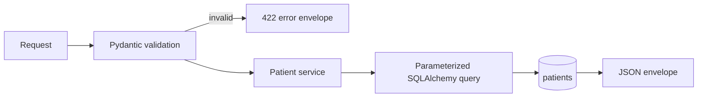

# REST API

Interactive OpenAPI documentation is served at `/docs` and the raw schema at `/openapi.json`.

## Resource flow



## Endpoints

| Method | Path | Success | Notes |
|---|---|---:|---|
| `GET` | `/health` | 200 | Includes a database probe |
| `GET` | `/patients` | 200 | Filters: `last_name`, `date_of_birth`, `phone_number`; pagination: `limit`, `offset` |
| `GET` | `/patients/{patient_id}` | 200 | Excludes soft-deleted rows |
| `POST` | `/patients` | 201 | Creates a UUID patient |
| `PUT` | `/patients/{patient_id}` | 200 | Partial update; the merged record is revalidated |
| `DELETE` | `/patients/{patient_id}` | 200 | Sets `deleted_at`; never hard-deletes |

## Envelopes

Success:

```json
{"data": {"patient_id": "..."}, "error": null}
```

Validation failure:

```json
{
  "data": null,
  "error": {
    "code": "validation_error",
    "message": "Request validation failed.",
    "details": [{"field": "phone_number", "message": "Value error, must be a valid 10-digit U.S. phone number", "type": "value_error"}]
  }
}
```

Status behavior: `200` read/update/delete, `201` create, `404` missing/deleted patient, `422` invalid request, and `500` database failure. Framework-level HTTP errors are also wrapped consistently.

Dates use ISO `YYYY-MM-DD` in JSON. Phone numbers are returned as ten digits. Timestamps are UTC ISO-8601 values.

