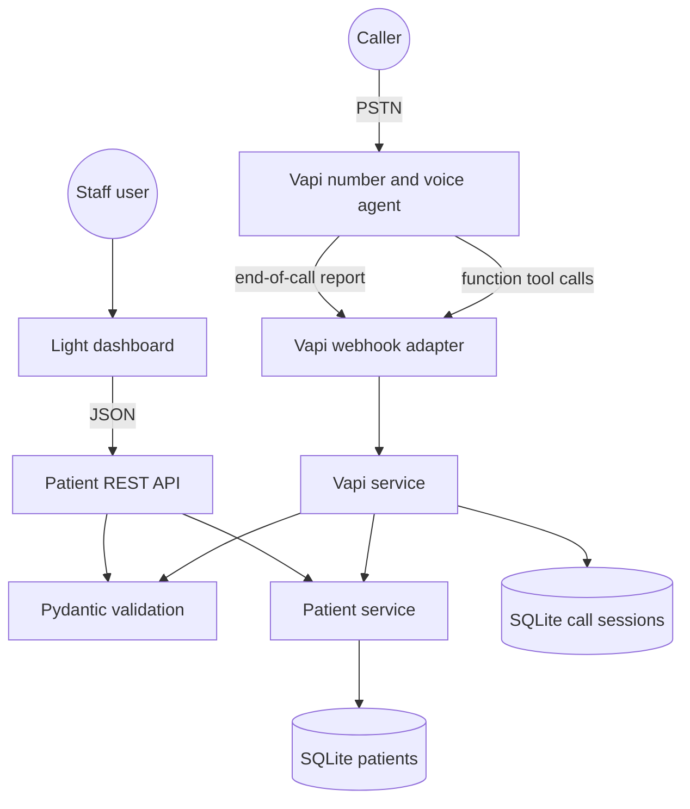
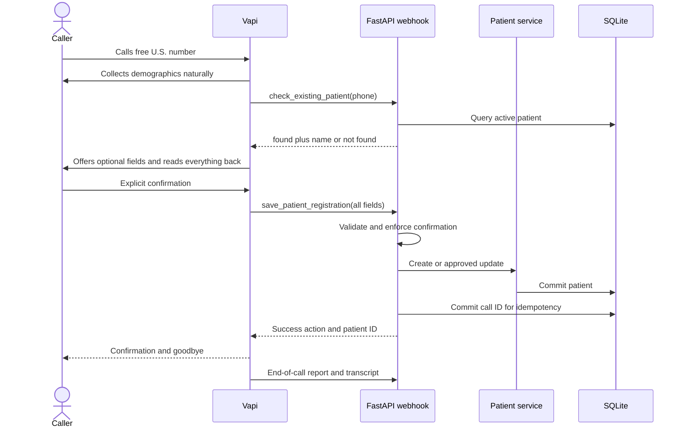
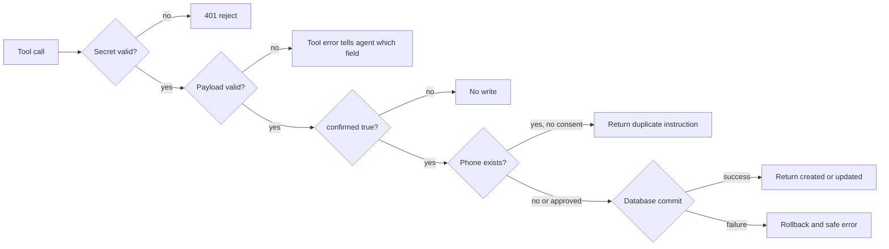

# Architecture

## Component map



Vapi handles the live conversation and the FastAPI application remains the validation and persistence boundary. Model-provided values are never written directly to the database.

## Responsibilities

| Component | Owns | Does not own |
|---|---|---|
| Vapi assistant | Speech, turn-taking, corrections, read-back, tool selection | Final validation or persistence |
| Vapi webhook adapter | Secret authentication and event routing | Patient business rules |
| Vapi service | Tool contract, idempotency, duplicate consent, transcript ingestion | HTTP presentation |
| Pydantic schemas | Normalization and demographic validation | Persistence |
| Patient service | Queries, create/update, and soft-delete | Voice behavior |
| SQLAlchemy models | Tables, types, indexes, constraints, and relations | Request validation |
| Dashboard | Staff search, create, edit, and delete UI | Business rules |
| FastAPI app | Composition, lifecycle, errors, and logging | Telephony transport |

## Registration sequence



## Failure boundaries



The Vapi call ID is stored with the committed patient. If Vapi retries the save tool, the service returns the prior result rather than creating a duplicate. Incomplete calls may store transcripts but never create patient records.

## Directory guide

```text
app/
├── api/                 REST, dashboard, health, and Vapi adapters
├── services/            Vapi and patient business logic
├── static/              Light dashboard assets
├── templates/           Dashboard HTML
├── config.py            Environment-backed settings
├── database.py          Engine and session lifecycle
├── models.py            Persistent entities and constraints
├── schemas.py           API and domain validation
└── main.py              Application composition and errors
vapi/                    Assistant prompt and function-tool schemas
tests/                   API, persistence, dashboard, and Vapi tests
docs/                    Operator and developer documentation
```
