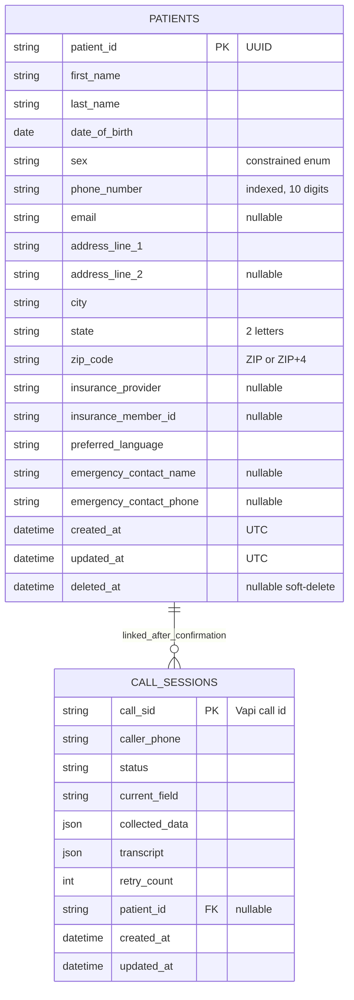

# Data model

`patients` is the canonical demographic record. `call_sessions` is a durable workflow record: it separates unconfirmed speech data from registered patient data and enables idempotent Vapi tool calls.

Application validation provides detailed field errors. Database constraints remain a second line of defense for sex values, state length, ZIP length, required columns, primary keys, and the call-to-patient foreign key. The composite lookup index covers assessment filters; phone also has its own index for duplicate detection.

Soft-deleted patients remain in storage for audit/recovery but are excluded from all public patient reads and duplicate matching.

