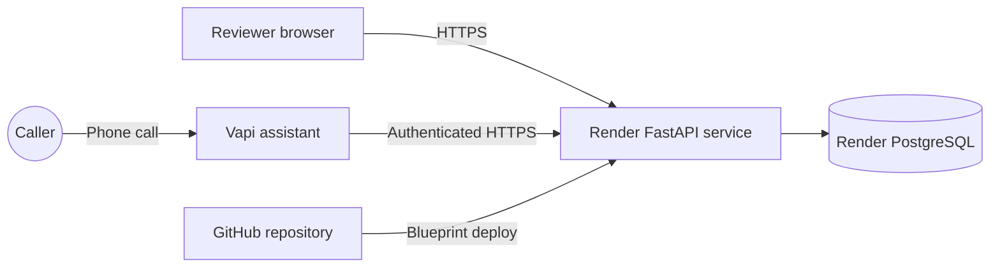

# Free submission deployment on Render

This runbook creates a public assessment deployment with a FastAPI web service and a persistent PostgreSQL database. The dashboard, REST API, and Vapi webhook share one HTTPS origin.

> Use fictional demonstration data only. This assessment deployment has no staff login and is not represented as HIPAA-compliant.

## Deployed architecture



The repository includes `render.yaml`. Render reads it to create both required resources and inject the database connection string without committing credentials.

## Before deploying

You need:

- A GitHub repository containing this project
- A free Render account
- The working Vapi assistant and phone number
- A copy of the same webhook secret used in Vapi

Generate a secret if you need a new one:

```bash
python3 -c "import secrets; print(secrets.token_urlsafe(32))"
```

Never commit the generated value. If you change it, update both Render and the Vapi credential.

## 1. Push the project to GitHub

Create an empty GitHub repository, then from this project folder run:

```bash
git init
git add .
git commit -m "Complete voice patient registration assessment"
git branch -M main
git remote add origin https://github.com/YOUR_USERNAME/YOUR_REPOSITORY.git
git push -u origin main
```

If the folder is already a Git repository, commit the current changes and push them instead of running `git init` again.

## 2. Create the Render Blueprint

1. Sign in at <https://dashboard.render.com/>.
2. Select **New → Blueprint**.
3. Connect GitHub and select this repository.
4. Keep the Blueprint file path as `render.yaml`.
5. When Render asks for `VAPI_WEBHOOK_SECRET`, enter the exact secret used by the Vapi credential.
6. Approve the free web service and free PostgreSQL database.
7. Wait until `carecloud-voice-registration` shows **Live**.

Render will provide a URL similar to:

```text
https://carecloud-voice-registration.onrender.com
```

Verify all three public routes:

```text
https://YOUR-RENDER-DOMAIN/
https://YOUR-RENDER-DOMAIN/health
https://YOUR-RENDER-DOMAIN/docs
```

The health route should return a response containing `"status":"healthy"`.

## 3. Point Vapi at Render

Update both Vapi Function/Custom Tools:

- `check_existing_patient`
- `save_patient_registration`

For each tool, set its Server URL to:

```text
https://YOUR-RENDER-DOMAIN/vapi/webhook
```

Select the credential whose token exactly matches Render's `VAPI_WEBHOOK_SECRET`. Using a Bearer Token credential with the `Authorization` header and **Include Bearer Prefix** enabled is supported by the application.

Then open the assistant and configure:

- Server URL: the same `/vapi/webhook` URL
- Authorization: the same credential
- Server message: `end-of-call-report`
- Tools: the latest saved versions of both tools

Publish the assistant and confirm that the free inbound number is assigned to this published assistant.

## 4. Run the submission smoke test

Open the deployed dashboard first and wait for it to load. Then:

1. Call the Vapi number using fictional information.
2. Give one invalid phone number and verify that the assistant asks again.
3. Complete all required fields.
4. Let the assistant perform the full read-back.
5. Explicitly say that everything is correct.
6. Wait for the success message before hanging up.
7. Refresh the deployed dashboard and verify the patient appears.
8. Call again with the same phone number and verify duplicate/update handling.

Also verify:

```bash
curl -fsS https://YOUR-RENDER-DOMAIN/health
curl -fsS https://YOUR-RENDER-DOMAIN/patients
```

## What to send the reviewer

Provide:

- GitHub repository URL
- Deployed dashboard URL
- API documentation URL: `https://YOUR-RENDER-DOMAIN/docs`
- Health URL: `https://YOUR-RENDER-DOMAIN/health`
- Vapi U.S. phone number
- A note asking them to open the dashboard before calling
- A note to use fictional data only

## Free-tier limitations

- Render's free web service sleeps after 15 minutes without inbound traffic and can take about one minute to wake. Opening the dashboard before a test call wakes it.
- The free Render PostgreSQL database expires 30 days after creation. Deploy it close to the submission date and verify it before the review.
- The free database is limited to 1 GB and has no backups.
- Without a payment method, Render can suspend the service when included usage is exhausted instead of charging you.
- The Vapi number does not require a payment method, but calls consume the available Vapi credit balance.

These limits are suitable for an assessment demonstration, not a production healthcare system.

## Alternative Docker deployment

For a paid host or a server with a persistent volume, see [Docker deployment](DOCKER_DEPLOYMENT.md). Mount persistent storage at `/app/data` when using SQLite, or provide a PostgreSQL `DATABASE_URL`.

## Troubleshooting

### Render build cannot import psycopg

Confirm the deployed commit includes `psycopg[binary]` in `pyproject.toml`, then select **Manual Deploy → Clear build cache & deploy**.

### Dashboard loads but registrations do not appear

Check Render **Logs** while making a call. A `401` means the Render secret and Vapi credential differ. `Unknown tool` means Vapi is using an old deployment or tool version. Publish the latest assistant version after updating its tools.

### The first call after inactivity fails

Open the dashboard and wait for `/health` to return healthy before placing the call. This avoids the free service cold start during the conversation.
