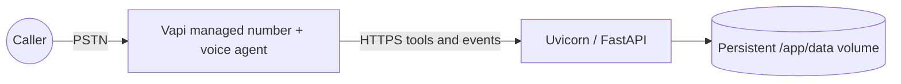

# Deployment and telephony runbook

## Runtime topology



## Docker

```bash
cp .env.example .env
# Fill VAPI_WEBHOOK_SECRET, PUBLIC_BASE_URL, and the Vapi deployment identifiers.
docker compose up --build
```

The Compose volume stores SQLite outside the container lifecycle. For Railway, Render, Fly.io, or another platform, attach a persistent disk at `/app/data`, expose port `8000`, and run:

```bash
uvicorn app.main:app --host 0.0.0.0 --port 8000
```

Do not use ephemeral container storage for the SQLite file: records would disappear on redeploy.

## Vapi setup

1. Deploy this app to a public HTTPS URL and set a long random `VAPI_WEBHOOK_SECRET`.
2. In Vapi, create a blank assistant and paste `vapi/assistant-prompt.md` as its system prompt.
3. Create two Custom Function Tools using the JSON files in `vapi/`. Replace `YOUR_DOMAIN` in each server URL.
4. Create a Vapi custom credential that sends `VAPI_WEBHOOK_SECRET` as an `X-Vapi-Secret` header, and attach it to both tool servers and the assistant server URL.
5. Set the assistant server URL to `{PUBLIC_BASE_URL}/vapi/webhook` and include `end-of-call-report` in Server Messages.
6. Create the free inbound U.S. number and assign this assistant under Inbound Settings. Do not add a payment method or enable auto-reload if you want to avoid charges.
7. Call the number, confirm an intake, then query `GET /patients?phone_number=...`.

## Smoke test

```bash
curl -fsS https://YOUR_DOMAIN/health
curl -fsS https://YOUR_DOMAIN/patients
```

Call script:

1. Provide all required fields, with one intentionally invalid ZIP to test recovery.
2. Correct one field during the final read-back.
3. Confirm and check the dashboard.
4. Call again using the same patient phone number to verify duplicate/update behavior.
5. Restart the app and confirm the patient still appears.

## Production hardening checklist

- Put the dashboard/API behind identity-aware authentication and role-based access.
- Replace SQLite with encrypted managed PostgreSQL for multiple replicas.
- Configure encrypted backups and test restoration.
- Execute BAAs with applicable vendors and perform a HIPAA security/risk review.
- Add access audit events without putting PHI in infrastructure logs.
- Add rate limits, request-size limits, alerting, uptime checks, and secret rotation.
- Define transcript retention/deletion policy before handling real patients.

