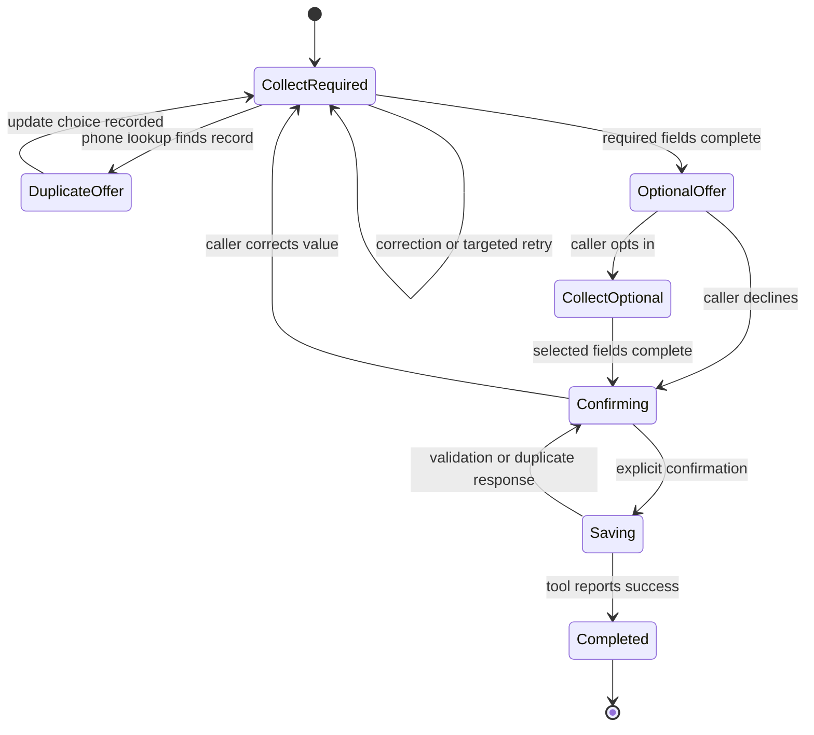
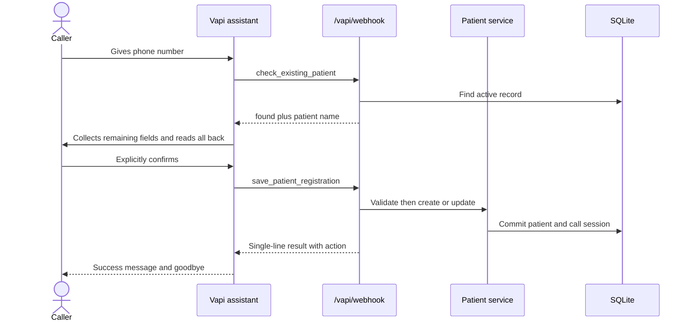

# Vapi voice agent

Vapi owns the live audio path: PSTN connectivity, transcription, turn detection, model execution, voice synthesis, interruption handling, and call termination. This application remains the authoritative validator and patient system of record.

## Conversation state

## Components

- `vapi/assistant-prompt.md` defines collection order, correction behavior, optional-field consent, complete read-back, and confirmation gating.
- `vapi/check-existing-patient-tool.json` checks a normalized phone number as soon as it is available.
- `vapi/save-patient-tool.json` submits the complete confirmed record.
- `POST /vapi/webhook` authenticates and dispatches Vapi events.
- `app/services/vapi.py` validates tool input, detects duplicates, creates or updates patients, prevents retry duplicates, and stores transcripts.

## Tool sequence

## Safety and resilience

| Situation | Behavior |
|---|---|
| Missing confirmation | Server refuses to save even if the model calls the tool |
| Invalid demographic value | Vapi receives a validation error and asks only for that field |
| Existing phone without update consent | Server returns duplicate details but makes no change |
| Repeated save webhook | Existing call-session result is returned; no duplicate row is created |
| Database failure | Transaction is rolled back and a safe tool error is returned |
| Forged webhook | Constant-time bearer/header secret check rejects it |
| Incomplete call | End-of-call report stores the transcript with no patient write |

Function-tool responses always use HTTP 200 with a `results` array and matching `toolCallId`, including tool-level errors, as required by Vapi. All caller-generated values are revalidated by Pydantic; the model cannot bypass domain rules.

## Privacy

Call transcripts contain PHI. The assistant configuration should leave recording disabled unless consent and retention requirements are defined. For a real healthcare deployment, verify vendor BAAs, retention, access controls, and audit policy before receiving patient data.
