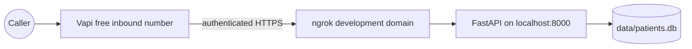

# Zero-payment Vapi setup guide

This connects the project to a real inbound U.S. number without adding a payment method. FastAPI and SQLite run on your computer, ngrok provides public HTTPS, and Vapi handles the call.

> Use fictional demonstration patients only. This free setup is not a production HIPAA deployment.

## Final topology



Your computer must remain on with FastAPI and ngrok running while reviewers test the system.

## 1. Start the application

From the repository root:

```bash
python3 -m venv .venv
source .venv/bin/activate
pip install -e ".[dev]"
cp .env.example .env
```

Generate a webhook secret:

```bash
python -c "import secrets; print(secrets.token_urlsafe(32))"
```

Open `.env` and set:

```dotenv
PUBLIC_BASE_URL=https://YOUR-NGROK-DOMAIN
DATABASE_URL=sqlite:///./data/patients.db
VAPI_WEBHOOK_SECRET=PASTE_THE_GENERATED_SECRET
VAPI_PRIVATE_API_KEY=
VAPI_ASSISTANT_ID=
VAPI_PHONE_NUMBER=
APP_ENV=development
LOG_LEVEL=INFO
```

The private Vapi key is optional because this guide uses the dashboard. Never put it in source files, prompts, screenshots, or messages.

Start FastAPI in terminal 1:

```bash
source .venv/bin/activate
uvicorn app.main:app --host 127.0.0.1 --port 8000
```

Verify `http://127.0.0.1:8000/health` returns `{"data":{"status":"healthy"},"error":null}`.

## 2. Create the free HTTPS tunnel

1. Create a free account at <https://dashboard.ngrok.com/signup>.
2. Install ngrok using its dashboard instructions.
3. Copy the account authtoken and run `ngrok config add-authtoken YOUR_TOKEN`.
4. In terminal 2, run `ngrok http 8000`.
5. Copy the HTTPS forwarding address, such as `https://example.ngrok-free.app`.
6. Put that exact origin in `.env` as `PUBLIC_BASE_URL`, then restart FastAPI.
7. Open `https://YOUR-NGROK-DOMAIN/health`, `/`, and `/docs` to verify the public service.

## 3. Create the Vapi webhook credential

1. Open the Vapi Dashboard.
2. Go to **Integrations → Server Configuration**.
3. Select **Add Custom Credential**, then **Bearer Token**.
4. Name it `CareCloud webhook`.
5. Use the exact `VAPI_WEBHOOK_SECRET` value as the token.
6. Set header name to `X-Vapi-Secret`.
7. Turn **Include Bearer Prefix** off and save.

Do not use the Vapi private API key as this webhook secret.

## 4. Create the duplicate-check tool

1. Go to **Tools → Create Tool → Custom Tool**.
2. Name it `check_existing_patient`.
3. Copy the description and schema from [`vapi/check-existing-patient-tool.json`](../vapi/check-existing-patient-tool.json).
4. Keep it synchronous and strict.
5. Set server URL to `https://YOUR-NGROK-DOMAIN/vapi/webhook`.
6. Set timeout to 10 seconds.
7. Under Authorization select `CareCloud webhook`, then publish.

## 5. Create the registration-save tool

1. Create another **Custom Tool** named `save_patient_registration`.
2. Copy the full schema from [`vapi/save-patient-tool.json`](../vapi/save-patient-tool.json).
3. Do not omit `confirmed` or `update_existing`.
4. Use the same server URL, timeout, and credential.
5. Keep it synchronous and strict, then publish.

The backend rejects saves unless `confirmed=true`, even if the model calls the tool too early.

## 6. Create the assistant

1. Go to **Assistants → Create Assistant → Blank Template**.
2. Name it `CareCloud Patient Registration`.
3. Set the first message to: `Hello! I am the patient registration assistant. I will collect your basic information. You can correct me at any time or say start over. What is your first name?`
4. Paste all of [`vapi/assistant-prompt.md`](../vapi/assistant-prompt.md) into the system prompt.
5. Choose a low-cost model such as the GPT-4o Mini option shown in the dashboard.
6. Use a standard Vapi voice and the default English transcriber.
7. Attach both custom tools.
8. Set maximum call duration to 300 seconds to protect the credit balance.
9. Leave recording disabled; transcripts are sufficient for this assessment.
10. Under **Advanced → Webhook Server**, set `https://YOUR-NGROK-DOMAIN/vapi/webhook`.
11. Select the `CareCloud webhook` credential.
12. Include `end-of-call-report` under Server Messages.
13. Publish the assistant.

## 7. Claim and connect the free number

1. Go to **Phone Numbers → Create Phone Number**.
2. Choose **Free Vapi Number**.
3. Enter a supported U.S. area code and create the number.
4. Wait until its status is active.
5. Open the number and select `CareCloud Patient Registration` under **Inbound Settings**.
6. Save. The free number is inbound-only, which is enough for this assessment.

## 8. Run the end-to-end test

Keep both terminals running and call the Vapi number.

1. Give an invalid phone number and confirm the agent asks again.
2. Provide all required demographics.
3. Decline or choose optional fields.
4. Correct the city or ZIP during final read-back.
5. Explicitly confirm the complete record.
6. Listen for the success message.
7. Open the public dashboard and confirm the patient appears.
8. Call again with the same patient phone and verify the update offer.
9. Restart FastAPI and verify the patient remains.

API verification:

```bash
curl "https://YOUR-NGROK-DOMAIN/patients?phone_number=5125550199"
```

## 9. Prevent unexpected charges

- Do not add a payment method to Vapi.
- Keep auto-reload disabled.
- Use only the free inbound number; do not start outbound calls.
- Keep the 300-second call maximum.
- Watch the credit balance after every test.
- Stop test calls once registration succeeds.
- Stay within the free ngrok development-domain limits.

When the Vapi balance reaches zero, calls should stop rather than charge you because no payment method is attached.

## 10. Prepare the submission

Keep FastAPI and ngrok running. Fill the submission section in `README.md` with the repository URL, free Vapi number, ngrok API base URL, dashboard URL, and the note `Inbound calls only; fictional demo data only`.

## Troubleshooting

| Symptom | Check |
|---|---|
| Call answers but nothing saves | Both tools are attached and the save tool is published |
| Tool returns 401 | Secret matches, header is `X-Vapi-Secret`, bearer prefix is off |
| Tool returns 404 | URL ends exactly in `/vapi/webhook` |
| Tool returns validation error | Inspect arguments and correct only the named field |
| Vapi says no result returned | Tool is synchronous and points to the supplied webhook |
| Transcript is absent | Assistant server URL and `end-of-call-report` are enabled |
| Public URL does not open | FastAPI and ngrok must both be running |
| Tunnel URL changed | Update `.env`, both tools, and the assistant server URL |
| Calls no longer start | Check whether the $5 Vapi balance reached zero |

Application logs identify completed registrations by patient UUID and call ID without printing the demographic payload.
